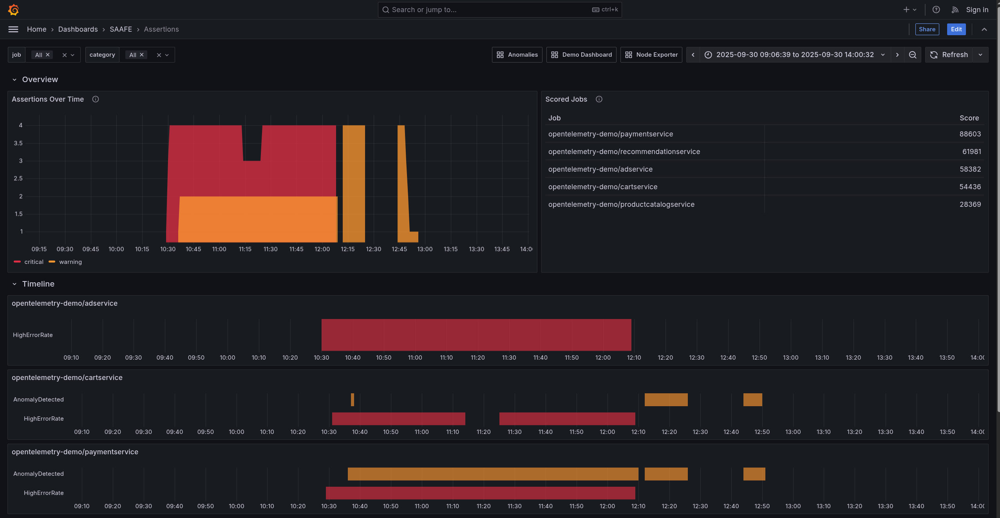
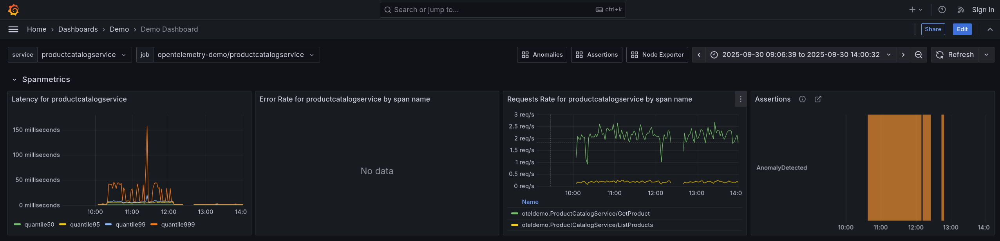

# SAAFE Model

SAAFE is an opinionated taxonomy of alerts designed to help troubleshoot incidents and extract valuable insights from existing metrics. It proposes a set of categories
and informs decisions on what to measure, how to turn metrics into insights, and how to visualize them to infer causality at a holistic level.

We provide an example implementation using Prometheus and PromQL, but the SAAFE model is generally applicable to any other environment supporting metrics and alerts.

## Getting Started

To see a demo of the SAAFE model in action, run the following commands.

```bash
cd demo
make start
```

You will need to have Docker installed to run the demo.  The demo will start a Prometheus instance, a Grafana instance, a node exporter instance and a version of the OTEL demo.

Once everything is running, head to [http://localhost:8080/grafana](http://localhost:8080/grafana) to access the Grafana UI. From there, you will find a dashboard called "Assertions" within the "SAAFE" folder.

The demo dashboard shows all active assertions over time, the list of jobs ranked by aggregated assertion scores, and a timeline per job. This view can be used to correlate assertions holistically. Use the `job` dropdown to narrow down the list of jobs based on their score.

<p align="center"></p>

The demo also shows assertions can be incorporated into a generic service dashboard, and how to seamlessly link multiple dashboards while preserving the time range of interest, which can be useful during an investigation.

<p align="center"></p>


You can simulate assertions in multiple ways:

- Altering the traffic patterns in the load generator, which can be accessed at [http://localhost:8080/loadgen/](http://localhost:8080/loadgen/), leading to anomalies.
- Stopping some services via `docker stop <container_id>`, which will generate errors and failures.
- Stressing your system (e.g. `stress-ng --cpu 0 -t 20m`) which will generate saturation events.
- Changing the `OTEL_RESOURCE_ATTRIBUTES` environment variable to simmulate amend events.

## SAAFE Categories

The proposed set of categories is described as follows.

### Saturation

Saturation is applicable to resources and represents the extent at which the resource is utilized. Some examples include CPU, Memory, Storage and Network. Over-utilized resources can be a source or a consequence of failure, and therefore provide useful context during an investigation.

### Amend

Most failures are caused by a change in the system. Therefore, it is critical to keep track of changes to help identify the root cause of a given malfunction. This includes changes in the underlying infrastructure (scaling events, configuration changes) as well as changes in the workloads themselves (version updates).

### Anomaly

Anomalies can reflect organic pattern changes and do not always represent a problem on their own. However, they provide invaluable context in combination with the other categories. For example, an unexpected surge in traffic may be at the root of an incident, or an unexpected drop may indicate problems downstream.

### Failure

Failure occurs when a required pre-condition is not met. For example, a critical service or piece of infrastructure is down, a service instance is crash-looping, or an invariant is violated. While errors are often expected and tolerated to a certain degree, failures are binary conditions that indicate an unexpected problem affecting the integrity of the system.

### Error

An error indicates an unfulfilled or degraded response by a service. For example, a service was not able store a record in a database or timed out fetching the requested information. Errors are usually aggregated and compared to an expected SLO.

## Assertions - From Alerts to Insights

The SAAFE Model is designed to help you visualize events happening in your system at a holistic level and to focus your attention on the most relevant information.

Most monitoring systems already provide a mechanism to turn metrics into discrete events: Alerts. However, alerts (particularly non-critical ones) can be noisy and lead to what is known as "alert fatigue". In a nutshell, too many alerts make it hard to separate signal from noise, and over time decrease the confidence in the alerting system as a whole.

This is where `Assertions` come in. An Assertion is a specific type of alert, designed to provide relevant contextual information for effective root cause analysis and visualization at a global level.

Critical alerts are thus complemented with assertions to give you the "full picture" and allow you to taked a birds eye before drilling down into specific components.

### Ranking

Assertions can be ranked according to their duration and impact. The following formula is proposed:

```
score = duration * weight
```

with weight defined by the SAAFE criticality (1 for `info` and `warning`, 2 for `critical`).

## Usage

A reference implementation using Prometheus and Grafana is provided. The implementation follows a "bring-your-own" alerts approach, but some examples per category are provided under the `rules/saafe` folder.

Identify relevant alerts in your system and categorize them according to the SAAFE Model. This is done by adding the following labels to your alerts:

```yaml
labels:
    saafe_severity: info|warning|critical
    saafe_category: saturation|amend|anomaly|failure|error
```

> [!NOTE]
> For anomaly detection, have a look at [promql-anomaly-detection](https://github.com/grafana/promql-anomaly-detection).

The dashboards used in the demo can be found under `demo/src/grafana/provisioning/dashboards` and can be copied and modified as needed.
